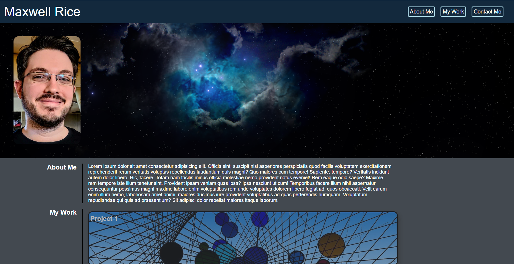

# Portfolio-Mk-1

This is my first attempt at making a portfolio using the HTML and CSS skills I've learned in the first two weeks of the UW Code Bootcamp.  The project needed the following requirements:

- A header with a NAVbar
- A hero image and a personal photo at the top of the page
- An "About Me" section
- A section with tiled image links that can be used to show personal projects
- Contact info at the bottom of the page
- Responsive design using flexbox and media queries

---

https://ricadbur.github.io/portfolio-mk-1/

